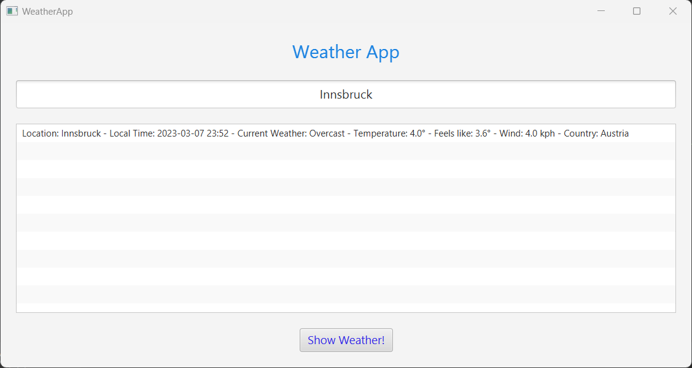

# Wetter App 
## Created by Caner Yildiz
Caner Yildiz (ic20b038@technikum-wien.at)

• To run the programme, the Server must be started first, then the WheatherApplication  
must be started. Then, after entering the city name in the GUI page, press Enter or  
click on the Show Weather! button.

**Must Have** 
  • Wetterdaten werden in der GUI angezeigt. -> Erledigt 
  • Die Wetterdaten gehen über den Server zum Client -> Erledigt 

**Should Have** 
  • Mehere Städte können für die Wetterausgabe ausgewählt werden. -> Erledigt 
  • Die Daten werden über eine online Internetseite imprtiert. -> Erledigt. 

**Nice to Have** 
  • Die Beispieldaten werden über File stream importiert          -> Erledigt 
  • Popup Werbung Werbung -> NICHT erledigt 

**Overkill** 
  • Live Daten für das Wetter anzeigen -> NICHT Erledigt 

**GUI sieht wie folgendes aus:** 
•
